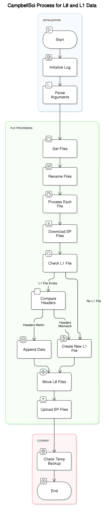

# Eddy Covariance System Data Processing (ECS_Process_L0)

This repository contains a suite of Python modules designed for processing, managing, and analyzing data collected from Campbell Scientific dataloggers using LoggerNet for Eddy Covariance systems. It is primarily focused on handling large datasets, automating metadata extraction, data cleaning, file management, and log management.

## Table of Contents

- [Introduction](#introduction)
- [Features](#features)
- [File Structure](#file-structure)
- [Code Overview](#code-overview)
  - [Main Processing Script](#main-processing-script)
  - [Libraries](#libraries)
    - [LibDataTransfer](#libdatatransfer)
    - [InfoFile](#infofile)
    - [Constants (`consts`)](#constants-consts)
    - [Configuration (`config`)](#configuration-config)
- [Installation](#installation)
- [Usage](#usage)
- [Contributing](#contributing)
- [License](#license)
- [Explanation of specific codes](#explanation-of-specific-codes)
  - [ECS_Process_L0.py](#ecs_process_l0py)
  - [InfoFile.py](#infofilepy)
  - [consts.py](#constspy)
  - [config.py](#configpy)
  - [ResampleData.py](#resampledatapy)

---

## Introduction
This project is aimed at automating the processing of environmental data, specifically focusing on data gathered from Campbell Scientific dataloggers. The primary goals of the repository are:

1. Automatically renaming, organizing, and processing data files.
2. Extracting metadata, checking for missing data, and ensuring data integrity.
3. Supporting the dynamic and static table structures used by various sites.
4. Generating log files and handling error reporting for data processing.

---

## Features

- **Automated Data Processing**: The system automatically handles data ingestion from dataloggers, checks for headers, resamples data if necessary, and stores processed files in well-defined structures.
- **Metadata Extraction**: Reads and stores file metadata such as timestamps, site names, logger types, and more.
- **Dynamic and Static Table Support**: Supports time-series data (dynamic) and metadata tables (static).
- **Error Handling & Logging**: Integrated logging system to track errors, missing files, and data inconsistencies.
- **Resampling and Cleaning**: The system can resample data based on predefined configurations, such as hourly, daily, or per-second intervals.

---

## File Structure
In the local server will be a temporal folder where the data will be stored before being uploaded to the cloud. The data will be stored in the following structure:

For more information about the file structure, please refer to the SharePoint/data/Metadata/File_Structure.pdf.

## Code Overview

### Main Processing Script

The main script is responsible for orchestrating the overall data processing pipeline:

- **Process Steps**:
  1. Renaming files with timestamps.
  2. Extracting metadata from filenames and headers.
  3. Checking for and handling L1 (processed) files.
  4. Uploading and downloading files to/from SharePoint.
  5. Backing up and archiving old data files.

### Libraries

#### **LibDataTransfer**

The `LibDataTransfer` module handles file and folder operations:
- **File Handling**: Moving, copying, renaming, and deleting files.
- **MD5 Checks**: Checking file integrity via MD5 hashing.
- **Zipping/Unzipping**: Compressing and decompressing files as needed.
- **CSV Handling**: Reading and writing Pandas DataFrames to CSV, with proper formatting for Campbell Scientific data.

#### **InfoFile**

The `InfoFile` class manages individual data files, extracting metadata, converting file formats, and loading data into Pandas DataFrames:
- **Metadata Handling**: Extracts datalogger type, program signature, station name, and more from the file headers.
- **Data Handling**: Loads data into Pandas DataFrames and can resample or clean the data as needed.
- **File Paths**: Organizes data into specific directories based on site, table, and date.

#### **Constants (`consts`)**

The `consts` module defines key constants used throughout the system:
- **Paths**: Specifies directories for data storage, backup, logs, etc.
- **File Structure**: Defines the folder and filename structure for different data levels (L0 and L1).
- **Time Formats**: Defines timestamp formats used across the system.
- **Frequencies**: Defines common data frequencies (e.g., daily, yearly, 30 minutes, 10 Hz).
- **Status Codes**: Status flags to indicate the health of a file (e.g., file exists, file is empty).

#### **Configuration (`config`)**

The `config` module provides metadata configurations for each data table:
- **Table Metadata**: Specifies file names, storage frequencies, resampling settings, and other configuration options for each table.
- **Default Values**: Provides default settings for tables, ensuring the system can guess the correct settings if the table is unknown.
- **Dynamic and Static Table Support**: Differentiates between dynamic (time-sequence) and static tables (e.g., metadata or configuration tables).

---

## Installation

### Prerequisites

- Python 3.x
- Required Python packages:
  - `pandas`
  - `numpy`
  - `datetime`
  - `zipfile`
  - `pathlib`
  - Any additional modules like `office365-api` for SharePoint integration


---

## Usage

The scrip can run atomatically using a `Task Scheduler` to process data files at regular intervals.


### Running Manually the Main Script

To run the main script, navigate to the root folder and use the following command:

```bash
python ECS_Process_L0.py
```

This will process all the files in the configured `LoggerNet` directory, extract metadata, clean the data, and organize the processed files into the appropriate directories. Logs will be created to track the progress and any errors that occur.

### Configuration

The `config` and `consts` modules are used to configure site-specific and table-specific settings. These configurations include file paths, data frequencies, resampling options, and plotting preferences.

For example, to modify the configuration for a table, you can update the `config.TABLES` dictionary in `config.py`.

### SharePoint Integration

The system supports integration with SharePoint via the `office365_api` module. Ensure you have proper authentication credentials in place for uploading and downloading files from SharePoint.
The 'office365_api' can be found on 


### Manually Running `ECS_Process_L0.py`

If you need to run the script manually, you do not need to pass any arguments; the script will execute using the default configuration.

When running the program via Task Scheduler, you must pass the `-a` argument.

When the script is run manually, it uses the same constants, but instead of the regular harvest folder (`consts.PATH_HARVESTED_DATA`), it will use the folder defined in `consts.PATH_TEMPSHARE` (typically `E:/TempShare`).

---

## Contributing

We welcome contributions to improve the system! Please follow these steps:

1. Fork the repository.
2. Create a new feature branch: `git checkout -b feature-branch-name`.
3. Make your changes and commit them: `git commit -m 'Add some feature'`.
4. Push the branch: `git push origin feature-branch-name`.
5. Open a Pull Request.

---

## License

This project is licensed under the Apache 2.0 License. See the [LICENSE](LICENSE) file for details.

---

### Explanation of specific codes:
## ECS_Process_L0.py

---

**Name**: CampbellSci Process for L0 and L1 Data

**Version**: 1.0

**Author**: Gesuri Ramirez

**Created**: 06/13/2023

**License**: Apache 2.0

---

### Purpose

This script automates the process of handling data files generated by Campbell Scientific data loggers. It is designed to rename files, extract and organize metadata, manage data level processing, and synchronize files with a SharePoint directory.

The data processing follows the below steps:
1. Renaming files from the `LoggerNet` folder by appending the current timestamp.
2. Loading file metadata and classifying the files by site and table name.
3. Checking for corresponding L1 files in a SharePoint folder.
4. Comparing the file headers of the current file with stored L1 files, renaming the stored L1 file if headers differ.
5. Appending new data to the existing L1 file or creating a new L1 file if none exists.
6. Moving L0 files to their corresponding directories.
7. Uploading processed files to SharePoint and backing them up to a temporary folder.
8. Cleaning up old backup files from the temporary folder based on a predefined expiration time.

---

### Script Flow

#### 1. **Imports**

- `pathlib`, `datetime`, `time`, `sys`, `os`: Standard Python libraries for file handling, time, and system operations.
- `systemTools`, `consts`, `Log`, `InfoFile`, `LibDataTransfer`: Custom modules that handle system tools, constants, logging, file metadata extraction, and file transfer.
- `office365_api`: Handles SharePoint integration.

#### 2. **Logging Setup**

```python
log = Log.Log(path=consts.PATH_GENERAL_LOGS.joinpath('ECS_Process_L0.log'))
```
- Initializes the logging system to keep track of operations performed during the script execution.

#### 3. **File Handling Functions**

- **getReadyFiles(dirList)**:
  - Renames files by adding the current timestamp to their names and returns the list of updated files.

- **cmd_help()**:
  - Displays the help message with information about the default folder paths used by the script.

- **arguments(argv)**:
  - Parses command line arguments to trigger help information or override default folder settings.

#### 4. **Backup and Log Management**

- **check_log_file(path)**:
  - Determines if a file is a log file by checking its extension and whether it resides in a log folder.

- **check_temp_backup()**:
  - Cleans up files from the temporary backup folder by deleting files older than the defined time limit (`consts.TIME_REMOVE_TEMP_BACKUP`).

#### 5. **SharePoint File Handling**

- **download_SP_files(pathfiles)**:
  - Downloads files from SharePoint. If a local file is newer or larger, the file in SharePoint is renamed, and the local file is used instead.

- **upload_SP_files()**:
  - Uploads files from the local folder to SharePoint. Uploaded files are then moved to a temporary backup folder.

#### 6. **Main Processing Logic**

- **run()**:
  - The core function that orchestrates the data processing for the Campbell Scientific files.
  - It handles the following steps:
    1. Renames the L0 files with the current timestamp using `getReadyFiles`.
    2. Reads and processes L0 files using the `InfoFile` class.
    3. Compares L0 files with corresponding L1 files, ensuring headers match and handling new or changed data accordingly.
    4. Resamples and cleans high-frequency data if necessary.
    5. Writes data to L1 files and moves processed files to their respective folders.
    6. Uploads processed files to SharePoint using `upload_SP_files`.

#### 7. **Execution Block**


- Handles script execution. It parses command-line arguments, calls the main processing function `run()`, and checks for old backup files in the temporary folder.

---

### Key Data Processing Steps

1. **File Renaming**:
   - Each file from the `LoggerNet` folder is renamed with a timestamp to ensure uniqueness and track processing times.

2. **Metadata Extraction**:
   - Metadata is extracted from the files (e.g., site name, table name) and used to organize and classify the files.

3. **Comparison of L0 and L1 Files**:
   - The headers of the newly processed file (L0) are compared with those of the corresponding L1 file. If differences are found (e.g., number of columns, column names, serial numbers), the L1 file is renamed, and the new data is appended.

4. **File Storage and Transfer**:
   - Processed files are either appended to existing L1 files or new L1 files are created.
   - Files are then moved to the appropriate storage folders based on their metadata and uploaded to SharePoint.

5. **Resampling and Cleaning**:
   - For high-frequency data (e.g., 10Hz), resampling is performed to ensure the data meets the desired storage frequency, such as daily or hourly averages.

---

### Key Functions and Classes

- **LibDataTransfer**: Handles file operations such as renaming, moving, and merging dataframes.
- **InfoFile**: Extracts and manages file metadata, including reading headers and processing the contents of each file.
- **office365_api**: Manages interaction with SharePoint for uploading and downloading files.
- **systemTools.ElapsedTime()**: Utility function used to log the execution time of various operations.

---

### Constants and Configuration

The script heavily relies on predefined paths and constants configured in the `consts` module. These include:

- **Storage Paths**: Directories for temporary backups, cloud storage, and logs.
- **Timestamp Formats**: Used for renaming files and time-related operations.
- **Frequencies**: Defines data resampling frequencies (e.g., daily, hourly, 10Hz).

---

### Error Handling and Logging

- **Logging**: The script logs important information, including any changes to files, warnings about mismatched data, and details of the SharePoint upload/download process. The logs help to trace issues during processing.
- **Warnings**: The script checks for mismatched headers and other inconsistencies (e.g., different numbers of columns) and logs warnings when these are detected.

---

### Conclusion

This script provides a comprehensive and automated solution for processing, managing, and synchronizing data files from Campbell Scientific data loggers. By integrating metadata extraction, file comparison, error handling, and SharePoint synchronization, the script ensures efficient and reliable data management for Eddy Covariance systems.

---


## InfoFile.py

---

**Name**: InfoFile

**Purpose**: The `InfoFile` class is designed to manage and process data files from environmental monitoring or data logging systems. It handles metadata extraction, data cleaning, file type conversion (e.g., TOB1 to TOA5), resampling, and file storage. It also logs issues encountered during the file processing, ensuring data quality and integrity.

---

### Key Features

- **Metadata Management**: Extracts metadata such as site name, creation date, and serial numbers from file headers and names.
- **Data Processing**: Reads files into a `pandas.DataFrame` for cleaning, resampling, and processing. It checks for data completeness and fragmentation.
- **File Path Setup**: Automatically sets up paths for raw (L0) and processed (L1) data, as well as resampled and fragmented data.
- **Logging**: Logs all errors, warnings, and file status updates, ensuring traceability.
- **File Status Tracking**: Manages file statuses through the `statusFile` dictionary, tracking issues like missing files, mismatched columns, etc.

---

### Class Attributes

- **path_file (pathlib.Path)**: Path to the file being processed.
- **path_log (pathlib.Path)**: Path to the log directory.
- **ext (str)**: File extension (e.g., `.dat`, `.csv`).
- **site (str)**: Site name or identifier.
- **date_created (str)**: Creation date of the file.
- **file_size (float)**: Size of the file in bytes.
- **datalogger_type (str)**: Datalogger type extracted from the file header.
- **serial_number (str)**: Serial number of the datalogger.
- **program_signature (str)**: Signature of the datalogger program.
- **station_name (str)**: Name of the station where the data was logged.
- **path_L0 (pathlib.Path)**: Path for raw L0 data.
- **path_L1 (pathlib.Path)**: Path for processed L1 data.
- **path_L1_resampled (pathlib.Path)**: Path for resampled L1 data.
- **resampling (bool)**: Indicates if resampling is needed for the data.
- **data (pandas.DataFrame)**: Data read from the file.
- **statusFile (dict)**: Tracks the file's status (exists, empty, column mismatch, etc.).

---

### Methods

1. **`__init__(self, pathFileName, cleanDataFrame=True, rename=True)`**
   - **Purpose**: Initializes the `InfoFile` class with the given file path, checks the file type, extracts metadata, and sets file paths.
   - **Parameters**:
     - `pathFileName (str or Path)`: Path to the file.
     - `cleanDataFrame (bool)`: Whether to clean the data (default: `True`).
     - `rename (bool)`: Whether to rename the file during processing (default: `True`).

2. **`getInfo(self)`**
   - **Purpose**: Extracts metadata from the file name and header, including site information, datalogger type, program signature, etc.
   - **Logs**: Errors for missing headers, empty files, or mismatched columns.

3. **`_setL0paths_(self)`**
   - **Purpose**: Sets the paths for storing raw (L0) data based on file metadata (e.g., site, project, date).

4. **`_setL1paths_(self)`**
   - **Purpose**: Sets the paths for storing processed (L1) data, including resampled and fragmented data if necessary.

5. **`genDataFrame(self)`**
   - **Purpose**: Reads the file into a `pandas.DataFrame`, cleans the data, and handles fragmentation.
   - **Logs**: Time taken to generate the DataFrame and any data issues.

6. **`checkData(self)`**
   - **Purpose**: Groups the data by day and checks for missing data. Logs the percentage of missing records.

7. **`setFragmentation(self)`**
   - **Purpose**: Analyzes the file's data for fragmentation and updates the file's frequency for storage.

8. **`setStorageFrequency(self, freq=None)`**
   - **Purpose**: Sets the storage frequency based on file frequency or a provided frequency.

9. **`cleanDataFrame(self)`**
   - **Purpose**: Cleans the `pandas.DataFrame` by removing flagged or invalid data.

10. **`ok(self)`**
    - **Purpose**: Checks if the file is in a good state based on status flags.
    - **Returns**: `True` if no issues are flagged, `False` otherwise.

11. **`print(self, returnDict=False)`**
    - **Purpose**: Prints or returns the current attributes and values of the `InfoFile` instance.

12. **`printPaths(self)`**
    - **Purpose**: Prints all attributes related to file paths.

13. **`terminate(self)`**
    - **Purpose**: Terminates processing and logs all active status flags.

---

### Usage Example

```python
# Example usage of the InfoFile class
from pathlib import Path

# Path to a file
p = Path(r'data/CR3000_flux_20220707_030000.TOA')

# Instantiate InfoFile
info = InfoFile(p)

# Extract metadata
info.getInfo()

# Generate DataFrame
info.genDataFrame()

# Check for missing data
info.checkData()

# Set fragmentation and storage frequency
info.setFragmentation()
```

---

### Error Handling

- **File Not Found**: Logs and sets the `STATUS_FILE_NOT_EXIST` flag if the file is missing.
- **Empty File**: Logs and sets the `STATUS_FILE_EMPTY` flag if the file is empty.
- **Mismatched Columns**: Logs and sets the `STATUS_FILE_MISSMATCH_COLUMNS` flag if the number of columns in the header and data rows do not match.
- **Critical Errors**: Calls `terminate()` if critical issues are encountered, stopping further processing of the file.

---

### Logging

The `InfoFile` class uses a `Log` object to log various messages throughout the file processing pipeline. These include:
- **Live Messages**: Logged during key steps such as data generation and cleaning.
- **Warnings**: Logged for potential issues like missing records or empty DataFrames.
- **Errors**: Logged for critical issues like missing headers, mismatched columns, or file not found errors.
- **Performance Logs**: Logs the time taken to perform key operations such as reading files, cleaning data, and setting paths.

---

### Conclusion

The `InfoFile` class automates the process of managing, processing, and storing data files from environmental monitoring systems. It ensures data integrity through rigorous checks and logs while handling metadata extraction, data cleaning, and file resampling. With its error-handling capabilities, `InfoFile` ensures smooth and reliable data processing, making it a crucial component in managing large datasets from monitoring systems.

---

## consts.py

#### Purpose:
This module provides a collection of constants and configurations used across scripts in the Eddy Covariance System
(ECS) data processing pipeline. It defines paths, file structure versions, time formats, logging configurations, and
file handling rules for different stages (L0, L1) of data processing. The constants are primarily used to handle data
from Campbell Scientific dataloggers.

---

### General Constants:

- **`dev (bool)`**:
  - **Purpose**: Flag to indicate if the system is in development (`True`) or production (`False`).
  - **Example**: Set to `True` for development environments, `False` for production.

---

### Site Constants:

- **`_SITES_ (list)`**:
  - **Purpose**: List of site names that are processed by the system.
  - **Example**: `['Pecan5R', 'RedLake', 'Kimberly', 'Bahada']`.

- **`SITE_4_FILE (dict)`**:
  - **Purpose**: Maps the site names used in filenames to the actual site names.
  - **Example**: `{'Pecan5R': 'Pecan5R', 'RedLake': 'RedLake', ...}`.

- **`ECS_NAME (str)`**:
  - **Purpose**: The folder name for Eddy Covariance system files.
  - **Default**: `'Tower'`.

---

### Paths:

- **`PATH_HARVESTED_DATA (Path)`**:
  - **Purpose**: Path where LoggerNet saves collected data.
  - **Example**: `'C:/temp/Collected/'` (development) or `'E:/temp/Collected/'` (production).

- **`PATH_TEMP_BACKUP (Path)`**:
  - **Purpose**: Temporary backup folder for data before moving to permanent storage.
  - **Example**: `'C:/LatestData/'` (development) or `'E:/LatestData/'` (production).

- **`PATH_CLOUD (Path)`**:
  - **Purpose**: Path to permanent storage (SharePoint).
  - **Example**: `'C:/Data/'` (development) or `'E:/Data/'` (production).

- **`PATH_GENERAL_LOGS (Path)`**:
  - **Purpose**: Directory where general logs are stored.
  - **Default**: `PATH_CLOUD.joinpath('Logs')`.

- **`PATH_CHECK_FILES (Path)`**:
  - **Purpose**: Directory where files that need review are stored (unprocessed or problematic files).
  - **Default**: `PATH_HARVESTED_DATA.joinpath('CheckFiles')`.

- **`PATH_FILES_NOT_UPLOADED (Path)`**:
  - **Purpose**: Directory where files that failed to upload are stored.
  - **Default**: `PATH_HARVESTED_DATA.joinpath('NotUploaded')`.

---

### File Structure and Metadata:

- **`CS_FILE_METADATA (dict)`**:
  - **Purpose**: Mapping of metadata fields for Campbell Scientific files (e.g., file type, station name).
  - **Example**: `{'type': 0, 'stationName': 1, 'model': 2, ...}`.

- **`CS_FILE_HEADER_LINE (dict)`**:
  - **Purpose**: Metadata fields for file headers (e.g., hardware info, fields, units).
  - **Example**: `{'HARDWARE': 0, 'FIELDS': 1, ...}`.

- **`CS_FILE_NAME_SITE (int)`**:
  - **Purpose**: The position of the site name in the file name.
  - **Default**: `0`.

- **`CS_FILE_NAME_DATALOGGER (int)`**:
  - **Purpose**: The position of the datalogger name in the file name.
  - **Default**: `1`.

- **`CS_FILE_NAME_TABLE (int)`**:
  - **Purpose**: The position of the table name in the file name.
  - **Default**: `2`.

- **`FILE_STRUCTURE_VERSION (int)`**:
  - **Purpose**: Specifies the file structure version (1 for old, 2 for new).
  - **Default**: `2`.

---

### Data Levels:

- **`L0 (str)`**:
  - **Purpose**: Constant for Level 0 data (raw data).
  - **Default**: `'L0'`.

- **`L1 (str)`**:
  - **Purpose**: Constant for Level 1 data (processed data).
  - **Default**: `'L1'`.

---

### Time and Date Formats:

- **`SECONDS_TZ (int)`**:
  - **Purpose**: Time zone offset in seconds (Mountain Time Zone).
  - **Default**: `25200` (7 hours).

- **Timestamp Formats**:
  - `TIMESTAMP_FORMAT`: `'Ymd_HMS'` (for file names).
  - `TIMESTAMP_FORMAT_FILES`: `'Ymd_HMS'` (for file storage).
  - `TIMESTAMP_FORMAT_CS_LINE_HF`: `'Y-m-d H:M:S.f'` (high-frequency data format).
  - `TIMESTAMP_FORMAT_CS_LINE`: `'Y-m-d H:M:S'` (standard timestamp).
  - `TIMESTAMP_FORMAT_DAILY`: `'Ymd_0000'` (daily format).
  - `TIMESTAMP_FORMAT_YEARLY`: `'Y'` (yearly format).

---

### Frequency Constants:

- **`FREQ_YEARLY`**: `'Y'` (pandas yearly frequency).
- **`FREQ_DAILY`**: `'D'` (pandas daily frequency).
- **`FREQ_30MIN`**: 30-minute interval as a `Timedelta`.
- **`FREQ_2HZ`**: 0.5-second interval as a `Timedelta` (2 Hz frequency).
- **`FREQ_1MIN`**: 1-minute interval as a `Timedelta`.
- **`FREQ_10HZ`**: 0.1-second interval as a `Timedelta` (10 Hz frequency).

---

### File Extensions and Status:

- **File Extensions**:
  - `ST_NAME_TOA`: `'bin'` (folder for TOA files).
  - `ST_NAME_TOB`: `'RAWbin'` (folder for TOB files).
  - `ST_EXT_TOA`: `'TOA'` (extension for TOA files).
  - `ST_EXT_TOB`: `'DAT'` (extension for TOB files).

- **File Status Constants**:
  - `STATUS_FILE_NOT_EXIST`: File does not exist.
  - `STATUS_FILE_OK`: File is okay.
  - `STATUS_FILE_EMPTY`: File is empty.
  - `STATUS_FILE_NOT_HEADER`: File is missing a header.
  - `STATUS_FILE_MISSMATCH_COLUMNS`: File has mismatched columns.
  - `STATUS_FILE_EXCEPTION_ERROR`: File has an exception error.
  - `STATUS_FILE_UNKNOWN_FORMAT`: File has an unknown format.
  - `STATUS_FILE_NOT_READABLE`: File is not readable.

---

### General Data Handling:

- **`CS_DATA_DICT (dict)`**:
  - **Purpose**: Template dictionary to store metadata and file paths for Campbell Scientific files.
  - **Fields**: Includes fields like `extension`, `site`, `fileNameDT`, `headers`, `path`, `statusFile`, etc.

- **`MIN_PCT_DATA (float)`**:
  - **Purpose**: Minimum percentage of data required to consider the data valid.
  - **Default**: `0.1` (10%).

- **`TIME_REMOVE_TEMP_BACKUP (timedelta)`**:
  - **Purpose**: Time limit after which files are removed from the temporary backup.
  - **Default**: `7 days`.

- **`FLAG (int)`**:
  - **Purpose**: The flag value used for missing data.
  - **Default**: `-9999`.

- **`CLASS_STATIC`**: Indicates a static table.
- **`CLASS_DYNAMIC`**: Indicates a dynamic table.

- **`DEFAULT_L1_NAME_POSTFIX (str)`**:
  - **Purpose**: Default name postfix for L1 files (yearly format).
  - **Default**: `TIMESTAMP_FORMAT_YEARLY`.

- **`DEFAULT_FREQUENCY`**: Default table frequency (set to `FREQ_30MIN`).
- **`DEFAULT_SAVE_L0_TOB (bool)`**: Whether to save L0 TOB files.
- **`DEFAULT_ARCHIVE_AFTER (timedelta)`**:
  - **Purpose**: Default time after which files are archived.
  - **Default**: `2 years`.

---

### Usage:
The constants provided in this module are used throughout various data processing scripts to maintain consistency in
file handling, time formatting, logging, and managing the structure of the Eddy Covariance System. The file provides
flexibility for both development and production environments.

---

## config.py
#### Purpose:
The `config` module provides metadata and configurations for processing multiple sites, dataloggers, and tables used in
environmental monitoring and data logging. The configuration primarily helps to manage Campbell Scientific (CS)
dataloggers and tables, defining their attributes such as file names, folders, frequencies, classes (dynamic or static),
 and other parameters. This metadata is used in conjunction with the data processing pipeline to organize, analyze, and
 store time-series data.

---

### Metadata Constants:

- **`DEFAULT (str)`**:
  - **Purpose**: Used as a key in the table definitions to indicate default configurations.
  - **Default**: `'default'`.

- **`L1_FOLDER_NAME (str)`**:
  - **Purpose**: Key to specify the folder name for storing Level 1 (processed) data.
  - **Example**: `'l1FolderName'`.

- **`L1_FILE_NAME (str)`**:
  - **Purpose**: Key to specify the file name for Level 1 data files.
  - **Example**: `'l1FileName'`.

- **`L1_NAME_POSTFIX (str)`**:
  - **Purpose**: Key to specify a postfix (e.g., year) for file names to differentiate by time.
  - **Example**: `'l1NamePostfix'`.

- **`FREQUENCY (str)`**:
  - **Purpose**: Key to define the frequency of the table, either a dynamic (time-series) or static frequency.
  - **Example**: `'frequency'`.

- **`L1_FILE_FREQUENCY (str)`**:
  - **Purpose**: Key to define how frequently Level 1 files are stored (e.g., daily, yearly).
  - **Example**: `'l1FileFrequency'`.

- **`CLASS (str)`**:
  - **Purpose**: Key to classify the table as `static` or `dynamic`.
  - **Example**: `'class'`.

- **`SAVE_L0_TOB (bool)`**:
  - **Purpose**: Key to specify whether Level 0 TOB files (raw binary) should be saved.
  - **Example**: `'saveL0TOB'`.

- **`ARCHIVE_AFTER (timedelta)`**:
  - **Purpose**: Key to define when a file should be archived after a specific time period.
  - **Example**: `'archiveAfter'`.

- **`NAN_VALUE (int)`**:
  - **Purpose**: Key to define the value used for missing data (NaN).
  - **Example**: `'nanValue'`.

- **`INDEX_MAP_FUNC (function)`**:
  - **Purpose**: Key to define a function used to map and format the index (typically timestamps).
  - **Example**: `'indexMapFunc'`.

- **`COLS_2_PLOT (list)`**:
  - **Purpose**: Key to specify which columns should be plotted for visualization.
  - **Example**: `'cols2Plot'`.

- **`TIME_2_PLOT (DateOffset)`**:
  - **Purpose**: Key to define a time offset for plotting, such as `30 days`.
  - **Example**: `'time2Plot'`.

- **`PROJECT (str)`**:
  - **Purpose**: Key to associate the table with a specific project.
  - **Example**: `'project'`.

- **`RESAMPLE (str or bool)`**:
  - **Purpose**: Key to define if the table data should be resampled to a specific frequency (e.g., '1T' for 1 minute).
  - **Example**: `'resampled'`.

---

### Tables Configuration:

The `TABLES` dictionary contains metadata for each table that is being processed. Each table can inherit default values
or define its own custom configuration.

---

#### **Default Table Configuration (`DEFAULT`)**:
- **`L1_FOLDER_NAME`**: Default folder name for storing Level 1 data.
- **`L1_FILE_NAME`**: Default file name for Level 1 data.
- **`L1_NAME_POSTFIX`**: Postfix for filenames (default is yearly format).
- **`FREQUENCY`**: Default frequency (e.g., `30 minutes`).
- **`L1_FILE_FREQUENCY`**: How frequently Level 1 files are stored (default: yearly).
- **`CLASS`**: Specifies if the table is static or dynamic.
- **`SAVE_L0_TOB`**: Whether to save raw binary data for Level 0 files.
- **`ARCHIVE_AFTER`**: Archive files after a default period (e.g., 2 years).
- **`NAN_VALUE`**: Default NaN value (`-9999`).
- **`INDEX_MAP_FUNC`**: Function for formatting timestamps (default: None).
- **`COLS_2_PLOT`**: List of columns to plot (default: empty).
- **`TIME_2_PLOT`**: Default plotting period (e.g., 30 days).
- **`RESAMPLE`**: Default resampling setting (default: False).

---

### **`getTable(table)`**:
- **Purpose**: Returns the configuration for a given table. If the table is not defined, it uses the default
configuration.
- **Parameters**:
  - `table (str)`: The name of the table to retrieve.
- **Returns**: A dictionary of the table configuration.

---

### Usage:
This module defines and organizes the metadata needed for processing data from multiple dataloggers and tables in
environmental monitoring. It helps the main system by providing the necessary configuration (e.g., folder names, file
frequencies, and plotting preferences) for each table, allowing for easy integration and data handling in the
processing pipeline.

---

## ResampleData.py

---

**Name**: ResampleData

**Purpose**: The `ResampleData` class is designed to resample time-series data from CSV files to a lower frequency. It reads CSV files, resamples the data according to a specified frequency and method, and saves the processed data to new CSV files.

---

### Key Features

- **Input and Output Management**: The class accepts a directory or individual CSV files as input and generates resampled files in a specified or default output directory.
- **Resampling**: The class resamples data based on a specified frequency (e.g., `1 minute`, `10 minutes`, etc.) and using a specified method (e.g., `last`, `mean`).
- **Metadata Handling**: The class extracts metadata from the CSV file headers and preserves this metadata when saving the resampled data.
- **Debug Mode**: A debug flag allows the user to run the class without saving any output, useful for testing and troubleshooting.

---

### Class Attributes

- **`inPath (Path)`**: The input directory or file path containing the CSV files to be resampled.
- **`freq (str)`**: The resampling frequency, specified in pandas frequency strings (default: `'1T'` for 1 minute).
- **`outPath (Path)`**: The output directory or file path where the resampled CSV files will be saved.
- **`method (str)`**: The method to use for resampling (e.g., `'last'`, `'mean'`) (default: `'last'`).
- **`debug (bool)`**: Flag indicating whether to run in debug mode (default: `False`).
- **`df (pd.DataFrame)`**: The DataFrame that holds the data from the CSV file being processed.
- **`meta (dict)`**: Metadata extracted from the CSV file (e.g., headers).
- **`inPathFile (Path)`**: The current file being processed.
- **`outPathFile (Path)`**: The path for the resampled output CSV file.
- **`colNames (list)`**: Column names of the DataFrame loaded from the CSV file.
- **`inFiles (list)`**: List of input CSV files to be processed.

---

### Methods

1. **`__init__(self, inPath, freq='1T', outPath=None, method='last', debug=False)`**
   - **Purpose**: Initializes the `ResampleData` class with the input path, frequency, output path, and resampling method.
   - **Args**:
     - `inPath (str or Path)`: The input file or directory containing CSV files.
     - `freq (str)`: Resampling frequency (default: `'1T'` for 1 minute).
     - `outPath (str or Path)`: Output path to save resampled files (default: `None`).
     - `method (str)`: Resampling method (default: `'last'`).
     - `debug (bool)`: Debug mode flag (default: `False`).

2. **`doIt(self)`**
   - **Purpose**: Reads, resamples, and saves the data for each CSV file in the input directory or file.
   - **Process**:
     - Reads metadata and loads data into a DataFrame.
     - Resamples the data using the specified method and frequency.
     - Saves the resampled DataFrame to a new CSV file.

3. **`getDF(self)`**
   - **Purpose**: Reads the CSV file into a pandas DataFrame.
   - **Returns**: `pd.DataFrame`: The loaded DataFrame containing the data.

4. **`resampleData(self)`**
   - **Purpose**: Resamples the DataFrame using the method and frequency specified during initialization.
   - **Returns**: `pd.DataFrame`: The resampled DataFrame.

5. **`saveDF(self)`**
   - **Purpose**: Saves the resampled DataFrame to a new CSV file, including the original metadata headers.
   - **Args**:
     - `pathFile (str or Path)`: The file path where the DataFrame will be saved.
     - `df (pd.DataFrame)`: The DataFrame to save.

---

### Usage Example

```python
# Example usage of the ResampleData class
from pathlib import Path

# Set the input path for the CSV files
inPath = Path(r'C:\Data\Bahada\CR3000\L1\EddyCovariance_ts_2\2024')

# Initialize the ResampleData class with the input path and default parameters
resampler = ResampleData(inPath)

# The resampling process will start automatically upon initialization
print('Done!')
```

---

### How It Works

1. **Initialization**: The class accepts a path (file or directory), a resampling frequency, and a resampling method. If no output path is specified, the class will create a default one based on the input path.
   
2. **Resampling**: The `doIt` method reads each CSV file, extracts its metadata, resamples the data, and then saves the resampled data to a new CSV file. The frequency and method can be customized during initialization.
   
3. **Saving**: The resampled DataFrame is saved with the same column names and headers as the original CSV file, ensuring that metadata is preserved.

---

### Resampling Methods

- **`last`**: Uses the last valid observation for each resampled period.
- **`mean`**: Calculates the mean value for each resampled period.
- Other pandas-supported resampling methods (e.g., `sum`, `first`, `min`, `max`, etc.) can also be used.

---

### Debug Mode

- **`debug=True`**: When this flag is enabled, the resampled DataFrame is not saved to a CSV file. This mode is useful for testing and verifying the resampling process without writing any output.

---

### Conclusion

The `ResampleData` class provides an automated way to process and downsample time-series data stored in CSV files. It simplifies the resampling process by handling file reading, data transformation, and file saving while preserving the metadata from the original files.

